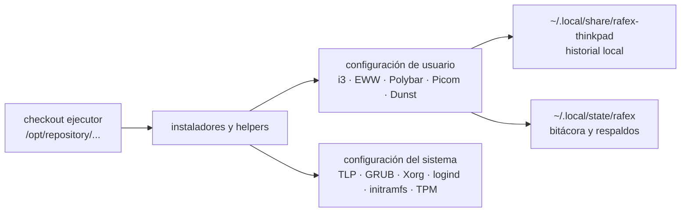

# thinkpad_config_audit_linux.sh

Audita la propiedad de configuraciones del perfil ThinkPad y detecta regresiones
sin cambiar la sesión ni archivos del sistema.

- **Ruta:** `scripts/system/thinkpad_config_audit_linux.sh`
- **SO requerido:** Linux
- **Dependencias:** Bash, `rg`; opcionalmente i3, systemd y procps para comprobaciones ampliadas.

---

## Índice

## Requisitos

Debe ejecutarse desde el repositorio que contiene el perfil
`thinkpad-x1-yoga-1st`. No requiere `sudo`.

## Uso

```bash
just thinkpad-config-audit --status
just thinkpad-config-audit --check
just thinkpad-config-audit --report
```

El informe incluye, para cada recurso, su propietario único, archivo o bloque,
dependencias, validador, exclusiones y política. El inventario de scripts se
genera en cada ejecución para que refleje los scripts presentes en el checkout.
También separa los destinos físicos compartidos —por ejemplo,
`~/.config/i3/config`— de sus bloques administrados y lista los candidatos que
escriben esas superficies, indicando si usan fragmentos generados, un guard de
propietario, una política de archivo exclusivo o si están clasificados como
`seed-only`. Además de `i3 -C`, comprueba semántica: modos y atajos
duplicados, bloques Rafex balanceados, una sola inclusión de barra, autostarts
duplicados, asignaciones contradictorias y composición por orden.

## Opciones

| Opción | Alias | Descripción |
|---|---|---|
| `--status` | — | Muestra el estado de recursos y regresiones conocidas. |
| `--check` | — | Igual que estado, pero falla si encuentra una inconsistencia. |
| `--report` | — | Emite un informe Markdown con tabla de scripts y grafo Mermaid. |
| `--output <archivo>` | — | Guarda el informe fuera del repositorio con permisos `0600`. |

## Variables de entorno

| Variable | Descripción |
|---|---|
| `XDG_CONFIG_HOME` | Directorio de configuración a auditar; por defecto `~/.config`. |
| `XDG_STATE_HOME` | Directorio de estado Rafex; por defecto `~/.local/state`. |
| `RAFEX_THINKPAD_HISTORY` | Repositorio local que registra lo instalado en la ThinkPad; por defecto `~/.local/share/rafex-thinkpad`. |

## Ejemplos

```bash
# Recomendado: revisión sin cambios.
just thinkpad-config-audit --check

# Guardar evidencia privada antes de instalar otro componente.
just thinkpad-config-audit --report \
  --output "$HOME/.local/state/rafex/thinkpad-config/audit-$(date +%F).md"
```

## Protecciones de seguridad

- Nunca modifica i3, EWW, Picom, Conky, Openbox, Xorg ni `/etc`.
- Solo escribe un informe cuando se proporciona explícitamente `--output`.
- No incluye secretos, contenido de mensajes ni configuraciones completas.
- Clasifica Firefox OS, Android y runtimes de desarrollo como fuera de la
  superficie del escritorio: aparecen en el inventario, pero no se tratan como
  propietarios de i3, EWW, Picom, Conky o energía.
- Rechaza un registro que asigne el mismo recurso o el mismo destino/bloque a
  más de un propietario.
- Señala los destinos físicos compartidos como una condición que requiere
  composición por fragmentos; no los considera seguros solo porque cada bloque
  tenga una etiqueta diferente.
- Comprueba que `~/.local/share/rafex-thinkpad` sea un repositorio Git con al
  menos un commit y sin cambios pendientes. Esa carpeta es historial local de
  lo instalado, no un clon fuente del repositorio replicador.

## Auditoría en vivo — 2026-09-08

Esta sección registra una comprobación directa de la ThinkPad usando el checkout
ejecutor sincronizado en `0135bcb`. La revisión privilegiada se ejecutó desde
`tmux thinkpad:0` y solo leyó archivos y estados; no recargó servicios ni
modificó configuraciones funcionales.

### Mapa operativo observado



El checkout ejecutor replica y ejecuta la configuración versionada. El
repositorio separado `~/.local/share/rafex-thinkpad` no es otro checkout fuente:
su función es conservar el estado instalado y su historial local.

### Estado confirmado

| Superficie | Evidencia | Resultado |
|---|---|---|
| Repositorio ejecutor | `HEAD=origin/main=0135bcb` | sincronizado |
| Historial local | commit `d4d693b` | inicializado, todavía sin artefactos capturados |
| TLP | `START=80`, `STOP=85`; servicio activo y habilitado | correcto |
| Arranque | `mem_sleep_default=deep` en GRUB | coherente con la política actual |
| Initramfs | `COMPRESS=zstd` | configurado |
| TPM | blacklist de `tpm`, `tpm_crb`, `tpm_tis` y `tpm_tis_core` | activo |
| Xorg | modesetting/DRI3 y touchpad con `NaturalScrolling=true` | coherente |
| Tapa | `HandleLidSwitch=suspend`, sin inhibidores configurados en el fragmento | configurado |
| Udev Android | `51-android.rules` presente | presente |
| i3 | `i3 -C` válido | correcto |
| Procesos | un Picom, un Polybar, un EWW y un Conky | sin duplicados observados |

### Incongruencias y riesgos

| Prioridad | Hallazgo | Impacto |
|---|---|---|
| crítica | `~/.config/i3/config`, `eww.scss` y el estado de barra son archivos regulares; el árbol generado no está desplegado | los instaladores pueden volver a competir con el archivo final |
| alta | `dunst.conf` sigue usando `origin=bottom-right` y `offset=(10,36)` | contradice el diseño debajo de la barra activa |
| alta | Picom v13 carga `shaders/nord.glsl`, pero el runtime rechaza `default_post_processing` | el shader no se aplica aunque Picom siga activo |
| media | EWW instalado es `0.5.0`, mientras el checkout contempla una instalación `0.6.0` | posible divergencia entre configuración y runtime |
| media | `rafex-config --sync` falló inicialmente porque el repositorio Git preexistente no tenía identidad local | el inicializador no es idempotente para un repositorio creado previamente |
| media | el manifiesto central contiene solo tres destinos dinámicos | no representa por sí mismo todos los scripts y archivos instalados |
| informativa | una consulta de i3 IPC por SSH no puede resolver `DISPLAY`/socket | las pruebas IPC deben ejecutarse dentro de la sesión gráfica |

La identidad Git se configuró únicamente de forma local en
`~/.local/share/rafex-thinkpad`; no se cambió la identidad global del usuario.

### Estrategia aprobada para estabilizar

1. Corregir el inicializador para que siempre establezca identidad local cuando
   el repositorio de historial ya exista, sin tocar la identidad global.
2. Añadir una operación de snapshot explícita que capture únicamente los
   archivos reconocidos como instalados, excluyendo secretos y datos personales.
3. Mantener la adopción de symlinks separada: no ejecutar `--adopt` como parte
   del snapshot.
4. Reparar Picom y Dunst individualmente, validando cada cambio antes de tocar
   el siguiente componente.
5. Decidir explícitamente si EWW debe permanecer en `0.5.0` o actualizarse a la
   versión del instalador; no mezclar ambas versiones silenciosamente.
6. Ejecutar después `thinkpad-config-audit --check`, `rafex-config --doctor`,
   `i3 -C` y comprobaciones de procesos dentro de la sesión gráfica.
7. Solo después evaluar `--adopt` por grupos y conservar rollback fechado.

La revisión no autoriza todavía la adopción de archivos, cambios de apilado,
recargas de servicios ni cambios en `/etc`.

## Fallos conocidos

### `Picom no está activo`

**Causa:** la unidad `rafex-picom.service` no está instalada o el autostart
genérico de Dex sigue siendo el único mecanismo disponible.

**Solución:** instalar y validar el servicio Rafex antes de modificar Picom.

### `EWW SCSS ausente`

**Causa:** el perfil fue copiado sin ejecutar el instalador EWW o el selector de
tema no pudo materializar la hoja de estilo.

**Solución:** ejecutar `just install-eww --apply` después de revisar el plan.

### `historial ThinkPad sin commits`

**Causa:** todavía no se ha adoptado el estado instalado en
`~/.local/share/rafex-thinkpad`.

**Solución:** no ejecutar aún una migración destructiva; primero generar un
manifiesto de archivos instalados, conservar respaldos y crear el primer commit
local de adopción.

## Changelog

### [Unreleased]

**feat:** incorpora auditoría de propietarios, recursos y dependencias ThinkPad.

**fix:** detecta colisiones por destino físico y valida el historial local de la
ThinkPad.

**feat:** añade validación semántica de i3 para bloquear regresiones de
contenido aunque el parser de i3 todavía acepte el archivo.
